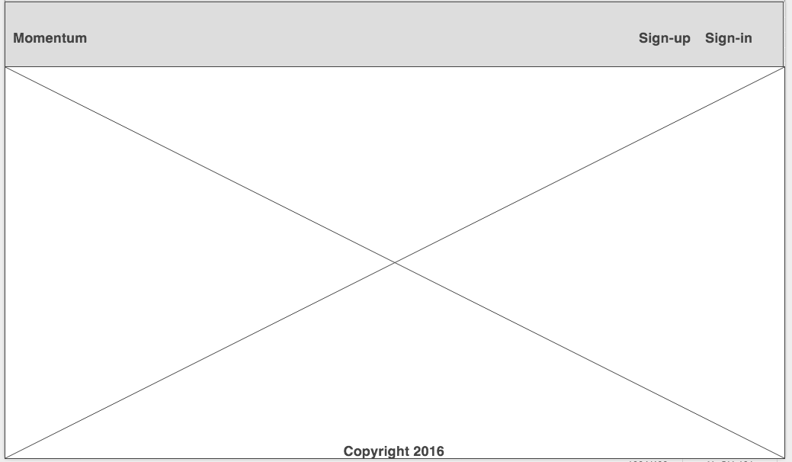
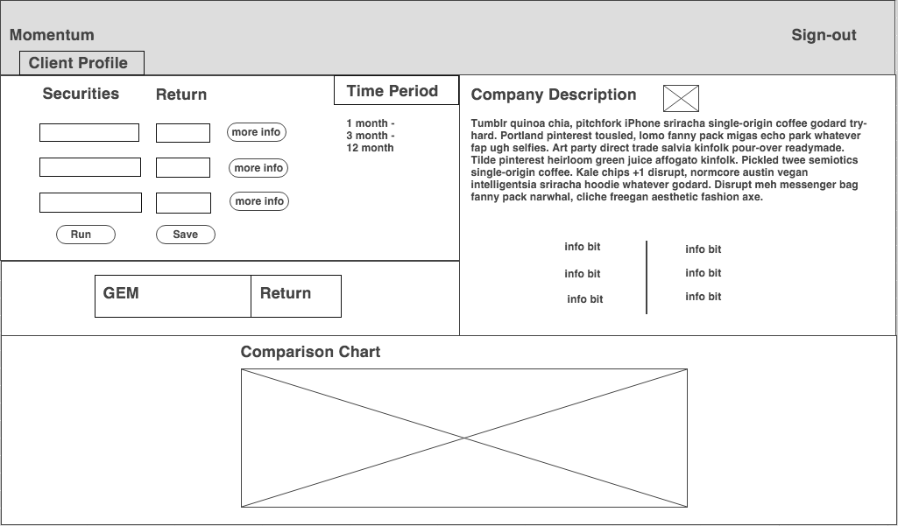
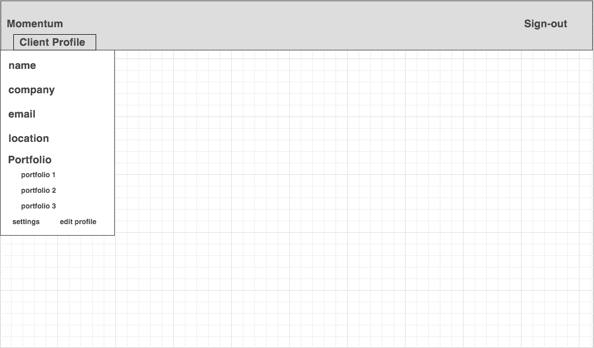

##Project II: Server-Side (Momentum)

Who uses it
-

Clients intersted in learning about the '*momentum*', the diffrence in return over a set period of time, of certain securities to reveal a potentially profitable investment opprotunity. 

What outputs do they need
-

Ticker-symbol of the holding(s) with strongest preformance over a set time period. 

What inputs are needed to generate those outputs
-

Three ticker-symbols and time horizon.

A list of technologies that you plan to use
-
Node.js, Jquery, Bootstrap, and will include:

    "body-parser": "^1.13.3",
    "cookie-parser": "^1.3.5",
    "debug": "~2.2.0",
    "ejs": "^2.3.4",
    "express": "^4.13.3",
    "knex": "^0.9.0",
    "locus": "^1.2.0",
    "method-override": "^2.3.5",
    "morgan": "^1.6.1",
    "pg": "^4.4.3",
    "serve-favicon": "^2.3.0"

A well-defined and written-out feature list
-

**Sign-in/Sign-out:**
  Client will be able to log-in using their Yahoo, Linkedin, and Google profiles

**Stock look-up and save:**
  Using [Markit api](http://dev.markitondemand.com/MODApis/) client will be able to look-up, select particular securities, and save these to their profile

**Main Feature - Comparison:**
 Compare three ticker symbols return for a specific time period  (provided by yahoo finance)

**Chart (Stretch):**
 Client profile will display comparison chart of selected tickers vs SPY

Wire Frame Layouts
-
**Homepage**

**Dashboard**

**User Profile Dropdown**

		